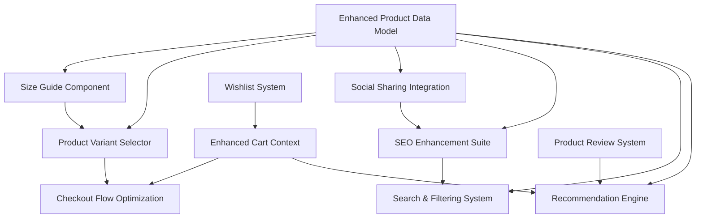
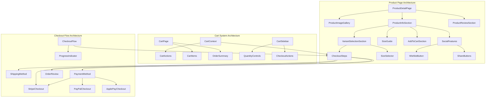
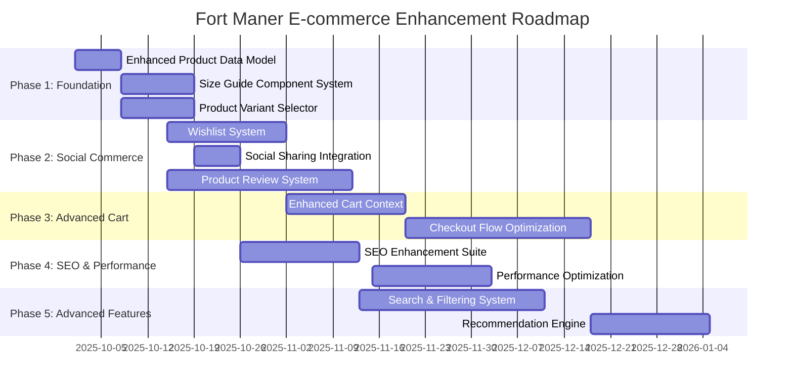

# PRD: Fort Maner E-commerce Platform Enhancement

Generated: 2025-09-25
Version: 1.0

## Table of Contents
1. [Source Ticket Reference](#source-ticket-reference)
2. [Technical Interpretation](#technical-interpretation)
3. [Functional Specifications](#functional-specifications)
4. [Technical Requirements & Constraints](#technical-requirements--constraints)
5. [User Stories with Acceptance Criteria](#user-stories-with-acceptance-criteria)
6. [Task Breakdown Structure](#task-breakdown-structure)
7. [Dependencies & Integration Points](#dependencies--integration-points)
8. [Risk Assessment & Mitigation](#risk-assessment--mitigation)
9. [Testing & Validation Requirements](#testing--validation-requirements)
10. [Monitoring & Observability](#monitoring--observability)
11. [Success Metrics & Definition of Done](#success-metrics--definition-of-done)
12. [Technical Debt & Future Considerations](#technical-debt--future-considerations)
13. [Appendices](#appendices)

---

## 1. Source Ticket Reference

**Request**: Create a comprehensive e-commerce audit and improvement plan for the Fort Maner luxury streetwear site.

**Current State Analysis**:
- Framework: Vite + React 18 + TypeScript + React Router v6 (NOT Next.js)
- 25 active routes including product detail, cart, checkout, and category pages
- shadcn/ui components + Tailwind CSS design system
- Basic CartContext with localStorage persistence
- ~150 products in JSON format with enhanced data models
- Basic ProductDetail component lacking advanced e-commerce features
- No size guide, limited social sharing, minimal SEO optimization

---

## 2. Technical Interpretation

### Current Architecture Assessment

#### ✅ Strengths
- **Solid Foundation**: Modern React 18 + TypeScript + Vite stack
- **Component System**: Complete shadcn/ui implementation with consistent design
- **State Management**: Functional cart system with localStorage persistence
- **Product Data**: Well-structured product schema with variants, collections, SEO metadata
- **Analytics**: Meta Pixel integration for conversion tracking
- **Performance**: React Query for server state management
- **Error Handling**: ErrorBoundary implementation

#### ⚠️ Critical Gaps
- **Product Discovery**: Missing size selectors, color variants, inventory management
- **SEO**: No structured data, missing Open Graph images, limited metadata
- **User Experience**: No wishlist, size guide, product recommendations, social sharing
- **State Management**: CartContext adequate but lacks advanced features (persistence, sync)
- **Checkout Flow**: Simulated Stripe integration, no real payment processing
- **Performance**: No image optimization, no lazy loading, no Core Web Vitals monitoring
- **Accessibility**: Missing ARIA labels, incomplete keyboard navigation
- **Data Management**: Local JSON files vs. headless CMS consideration

---

## 3. Functional Specifications

### 3.1 Routes & Information Architecture

#### Current Route Mapping
```typescript
// Existing Routes (25 total)
/ → Index (Landing page)
/product/:slug → ProductDetail
/men, /ladies, /kids → Category pages
/shop/fw, /shop/ss → Seasonal collections
/cart → Cart page
/checkout → Checkout flow
/checkout/success → Success page
/about, /blog, /community → Content pages
```

#### Proposed Enhanced Route Structure
```typescript
// Enhanced E-commerce Routes (32 total)
/ → Index (preserve landing)
/shop → Main shop page (new)
/shop/:category → Category pages (/shop/men, /shop/ladies, /shop/kids)
/shop/:category/:subcategory → Sub-categories (/shop/men/tees)
/collections/:collection → Collection pages (/collections/fw-24)
/product/:slug → Enhanced ProductDetail
/product/:slug/reviews → Product reviews (new)
/cart → Enhanced cart
/checkout → Multi-step checkout (new)
/checkout/shipping → Shipping step (new)
/checkout/payment → Payment step (new)
/checkout/success → Enhanced success page
/account → Account dashboard (new)
/account/orders → Order history (new)
/account/wishlist → Wishlist (new)
/search → Search results (new)
/size-guide → Size guide modal/page (new)
```

### 3.2 Product Page Requirements

#### Enhanced Product Detail Features
1. **Image Gallery**: Multi-image carousel with zoom, full-screen view
2. **Variant Selection**: Color swatches, size dropdown with stock levels
3. **Product Information**: Detailed descriptions, specifications, care instructions
4. **Social Features**: Share buttons (Twitter, Instagram, Facebook, Pinterest)
5. **Reviews & Ratings**: Customer reviews with star ratings
6. **Size Guide**: Interactive size guide modal
7. **Recommendations**: "You may also like" products
8. **Inventory Management**: Real-time stock levels, "notify when available"
9. **Wishlist**: Save for later functionality
10. **Recently Viewed**: Track and display recently viewed products

#### Size Guide Implementation
```typescript
interface SizeGuide {
  category: 'tops' | 'bottoms' | 'shoes' | 'accessories';
  measurements: {
    size: string;
    chest?: number;
    waist?: number;
    hip?: number;
    length?: number;
  }[];
  instructions: string[];
  fitGuide?: string;
}
```

### 3.3 Cart & State Management Enhancement

#### Current Cart Limitations
- Basic localStorage persistence
- No cart abandonment recovery
- No cross-device synchronization
- Limited cart analytics

#### Proposed State Management Strategy
**Phase A**: Enhanced Context API
- Persist cart state to server
- Add wishlist functionality
- Implement recently viewed
- Add cart analytics events

**Phase B**: Zustand Migration
- Global state management
- Optimistic updates
- Offline support
- Better TypeScript integration

```typescript
// Enhanced Cart Store Interface
interface CartStore {
  cart: {
    items: CartItem[];
    total: number;
    itemCount: number;
    currency: string;
    appliedDiscounts: Discount[];
  };
  wishlist: WishlistItem[];
  recentlyViewed: Product[];
  actions: {
    addToCart: (product: Product, variant: ProductVariant, quantity?: number) => void;
    removeFromCart: (itemId: string) => void;
    updateQuantity: (itemId: string, quantity: number) => void;
    applyDiscount: (code: string) => Promise<void>;
    toggleWishlist: (productId: string) => void;
    clearCart: () => void;
    persistCart: () => Promise<void>;
  };
}
```

### 3.4 Data Layer Strategy

#### Phase A: Enhanced Local JSON
- Structured product data with full e-commerce fields
- Static asset optimization
- JSON schema validation
- Build-time data processing

#### Phase B: Headless CMS Integration
- Shopify Storefront API
- Product synchronization
- Real-time inventory
- Order management

---

## 4. Technical Requirements & Constraints

### 4.1 Performance Requirements
- **Core Web Vitals**: LCP < 2.5s, FID < 100ms, CLS < 0.1
- **Image Optimization**: WebP format, lazy loading, responsive images
- **Bundle Size**: < 500KB initial bundle, code splitting by route
- **Caching**: Aggressive caching strategy for static assets

### 4.2 SEO Requirements
- **Meta Tags**: Dynamic title/description per product
- **Structured Data**: Product schema.org markup
- **Open Graph**: Product images for social sharing
- **Sitemap**: Dynamic XML sitemap generation
- **Robots.txt**: Proper indexing directives

### 4.3 Accessibility Requirements
- **WCAG 2.1 AA Compliance**: Full keyboard navigation, screen reader support
- **ARIA Labels**: Proper labeling for all interactive elements
- **Color Contrast**: Minimum 4.5:1 ratio for normal text
- **Focus Management**: Visible focus indicators, logical tab order

### 4.4 Browser Support
- **Modern Browsers**: Chrome 90+, Firefox 88+, Safari 14+, Edge 90+
- **Mobile**: iOS Safari 14+, Android Chrome 90+
- **Progressive Enhancement**: Core functionality without JavaScript

---

## 5. User Stories with Acceptance Criteria

### Epic 1: Enhanced Product Discovery

#### US-001: Product Variant Selection
**As a** customer
**I want to** select product color and size variants
**So that** I can purchase the exact item I want

**Acceptance Criteria:**
- [ ] Color swatches display available colors with product images
- [ ] Size dropdown shows available sizes with stock levels
- [ ] Out-of-stock variants are visually disabled
- [ ] Price updates dynamically based on variant selection
- [ ] URL updates to reflect selected variant
- [ ] "Notify when available" option for out-of-stock variants

#### US-002: Size Guide Integration
**As a** customer
**I want to** access a comprehensive size guide
**So that** I can select the correct size

**Acceptance Criteria:**
- [ ] Size guide modal opens from product page
- [ ] Measurement tables specific to product category
- [ ] Interactive fit recommendations
- [ ] Mobile-optimized size guide experience
- [ ] Size guide accessible via keyboard navigation

#### US-003: Product Image Gallery
**As a** customer
**I want to** view multiple product images in high quality
**So that** I can see product details clearly

**Acceptance Criteria:**
- [ ] Image carousel with thumbnail navigation
- [ ] Zoom functionality for detailed viewing
- [ ] Full-screen image gallery
- [ ] Touch/swipe gestures on mobile
- [ ] Keyboard navigation support

### Epic 2: Social Commerce Features

#### US-004: Social Sharing
**As a** customer
**I want to** share products on social media
**So that** I can get opinions from friends

**Acceptance Criteria:**
- [ ] Share buttons for Instagram, Twitter, Facebook, Pinterest
- [ ] Pre-populated share text with product details
- [ ] Open Graph images generate correctly
- [ ] Share analytics tracking implemented
- [ ] Native mobile share API integration

#### US-005: Wishlist Functionality
**As a** customer
**I want to** save products to a wishlist
**So that** I can purchase them later

**Acceptance Criteria:**
- [ ] Heart icon on product cards and detail pages
- [ ] Wishlist persists across sessions
- [ ] Wishlist accessible from header navigation
- [ ] Remove items from wishlist
- [ ] Move items from wishlist to cart

### Epic 3: Advanced Cart Experience

#### US-006: Enhanced Cart Management
**As a** customer
**I want to** manage my cart efficiently
**So that** I can complete my purchase smoothly

**Acceptance Criteria:**
- [ ] Quantity updates without page reload
- [ ] Cart total updates in real-time
- [ ] Free shipping threshold indicator
- [ ] Estimated delivery dates
- [ ] Save for later functionality
- [ ] Recently removed items recovery

#### US-007: Cart Abandonment Prevention
**As a** customer
**I want to** be reminded about items in my cart
**So that** I don't forget to complete my purchase

**Acceptance Criteria:**
- [ ] Cart persistence across devices (when logged in)
- [ ] Email reminders for abandoned carts
- [ ] Exit-intent cart recovery modal
- [ ] Cart expiration notifications

### Epic 4: Checkout Optimization

#### US-008: Streamlined Checkout Flow
**As a** customer
**I want to** complete checkout quickly and securely
**So that** I can receive my order promptly

**Acceptance Criteria:**
- [ ] Multi-step checkout with progress indicator
- [ ] Guest checkout option
- [ ] Address autocomplete functionality
- [ ] Multiple payment methods (Card, PayPal, Apple Pay)
- [ ] Order confirmation with tracking information

---

## 6. Task Breakdown Structure

### Phase 1: Foundation Enhancement (Sprint 1-2)

#### TASK-001: Enhanced Product Data Model
**Effort**: 5 story points (8 hours)
**Dependencies**: None
**Type**: Data Architecture

**Description**: Extend product schema with e-commerce-specific fields
```typescript
interface EnhancedProduct extends Product {
  inventory: {
    trackQuantity: boolean;
    allowBackorder: boolean;
    stockLevels: Record<string, number>; // variant ID -> stock count
  };
  seo: {
    title: string;
    description: string;
    keywords: string[];
    ogImage?: string;
  };
  sizing: {
    guide: string; // reference to size guide
    fitNotes?: string;
  };
  social: {
    shareTitle: string;
    shareDescription: string;
  };
  recommendations: string[]; // related product IDs
}
```

#### TASK-002: Size Guide Component System
**Effort**: 8 story points (12 hours)
**Dependencies**: TASK-001
**Type**: Feature Development

**Description**: Create interactive size guide modal component
- Size guide modal with measurement tables
- Category-specific sizing information
- Mobile-responsive design
- Integration with product pages

#### TASK-003: Product Variant Selector Enhancement
**Effort**: 8 story points (12 hours)
**Dependencies**: TASK-001
**Type**: Feature Development

**Description**: Implement advanced variant selection
- Color swatch component with image preview
- Size dropdown with stock indicators
- URL state management for variants
- Out-of-stock state handling

### Phase 2: Social Commerce (Sprint 3-4)

#### TASK-004: Wishlist System Implementation
**Effort**: 13 story points (20 hours)
**Dependencies**: None
**Type**: Feature Development

**Description**: Full wishlist functionality
- Wishlist context/store implementation
- Wishlist UI components
- Persistence layer (localStorage + future API)
- Integration across product pages

#### TASK-005: Social Sharing Integration
**Effort**: 5 story points (8 hours)
**Dependencies**: TASK-001
**Type**: Feature Development

**Description**: Comprehensive social sharing
- Share button component
- Open Graph meta tag generation
- Platform-specific sharing optimization
- Share analytics tracking

#### TASK-006: Product Review System
**Effort**: 21 story points (32 hours)
**Dependencies**: None
**Type**: Feature Development

**Description**: Customer review and rating system
- Review data model and storage
- Review display component
- Rating aggregation
- Review submission form
- Moderation workflow (admin)

### Phase 3: Advanced Cart & State Management (Sprint 5-6)

#### TASK-007: Enhanced Cart Context
**Effort**: 13 story points (20 hours)
**Dependencies**: TASK-004
**Type**: Refactoring

**Description**: Upgrade cart with advanced features
- Enhanced cart state management
- Cross-device persistence preparation
- Cart analytics integration
- Discount code system
- Save for later functionality

#### TASK-008: Checkout Flow Optimization
**Effort**: 21 story points (32 hours)
**Dependencies**: TASK-007
**Type**: Feature Development

**Description**: Multi-step checkout implementation
- Checkout progress indicator
- Shipping address form with validation
- Payment method selection
- Order confirmation system
- Guest checkout option

### Phase 4: SEO & Performance (Sprint 7-8)

#### TASK-009: SEO Enhancement Suite
**Effort**: 13 story points (20 hours)
**Dependencies**: TASK-001
**Type**: Technical Enhancement

**Description**: Comprehensive SEO optimization
- Dynamic meta tag generation
- Structured data implementation (schema.org)
- XML sitemap generation
- Open Graph image generation
- Search console integration

#### TASK-010: Performance Optimization
**Effort**: 13 story points (20 hours)
**Dependencies**: None
**Type**: Performance

**Description**: Core Web Vitals optimization
- Image optimization pipeline (WebP, lazy loading)
- Code splitting by route
- Bundle size analysis and optimization
- Caching strategy implementation
- Performance monitoring setup

### Phase 5: Advanced Features (Sprint 9-10)

#### TASK-011: Search & Filtering System
**Effort**: 21 story points (32 hours)
**Dependencies**: TASK-001
**Type**: Feature Development

**Description**: Advanced product search and filtering
- Search component with autocomplete
- Filter by category, price, color, size
- Search result page
- Filter persistence in URL
- Search analytics

#### TASK-012: Recommendation Engine
**Effort**: 13 story points (20 hours)
**Dependencies**: TASK-001, TASK-007
**Type**: Feature Development

**Description**: Product recommendation system
- "You may also like" component
- Recently viewed products
- Cross-sell recommendations
- Recommendation analytics
- A/B testing framework

---

## 7. Dependencies & Integration Points

### 7.1 Dependency Graph



### 7.2 Critical Path Analysis

**Critical Path**: TASK-001 → TASK-003 → TASK-008 (Total: 34 story points / 52 hours)

This represents the minimum viable e-commerce enhancement path focusing on:
1. Enhanced data model (foundation)
2. Variant selection (core shopping feature)
3. Optimized checkout (conversion optimization)

### 7.3 Parallel Work Streams

**Stream A (Core Commerce)**: TASK-001 → TASK-003 → TASK-008
**Stream B (Social Features)**: TASK-004 → TASK-005 → TASK-006
**Stream C (Performance)**: TASK-009 → TASK-010 → TASK-011

---

## 8. Risk Assessment & Mitigation

### 8.1 Technical Risks

#### HIGH RISK: State Management Complexity
**Risk**: Enhanced cart and wishlist state becomes difficult to manage
**Impact**: Performance degradation, bugs in cart functionality
**Mitigation**:
- Implement comprehensive state management testing
- Consider Zustand migration in Phase B
- Create state management documentation

#### MEDIUM RISK: Performance Regression
**Risk**: Adding features negatively impacts Core Web Vitals
**Impact**: SEO penalties, poor user experience
**Mitigation**:
- Implement performance budgets in CI/CD
- Use React Profiler for optimization
- Lazy load non-critical features

#### MEDIUM RISK: Data Migration Complexity
**Risk**: Enhanced product data model breaks existing components
**Impact**: Site downtime, broken product pages
**Mitigation**:
- Implement backward compatibility layer
- Staged data migration with validation
- Comprehensive regression testing

### 8.2 Business Risks

#### HIGH RISK: Checkout Abandonment During Migration
**Risk**: Changes to checkout flow confuse existing customers
**Impact**: Immediate revenue loss
**Mitigation**:
- A/B testing for checkout changes
- Feature flags for gradual rollout
- Rollback plan for all checkout modifications

#### MEDIUM RISK: SEO Ranking Impact
**Risk**: URL structure changes affect search rankings
**Impact**: Reduced organic traffic
**Mitigation**:
- 301 redirects for changed URLs
- Gradual URL structure migration
- Search Console monitoring

---

## 9. Testing & Validation Requirements

### 9.1 Automated Testing Strategy

#### Unit Testing Requirements
- **Coverage Target**: 85% for new components
- **Testing Framework**: Jest + React Testing Library
- **Focus Areas**: State management, cart logic, variant selection

#### Integration Testing
- **E2E Framework**: Playwright
- **Critical Paths**: Product discovery → Cart → Checkout → Success
- **Cross-browser**: Chrome, Firefox, Safari, Edge
- **Mobile Testing**: iOS Safari, Android Chrome

#### Performance Testing
- **Tools**: Lighthouse CI, WebPageTest
- **Metrics**: Core Web Vitals, Time to Interactive, Bundle Size
- **Thresholds**: LCP < 2.5s, FID < 100ms, CLS < 0.1

### 9.2 Manual Testing Checklist

#### Accessibility Testing
- [ ] Keyboard navigation for all interactive elements
- [ ] Screen reader compatibility (NVDA, VoiceOver)
- [ ] Color contrast compliance (WCAG AA)
- [ ] Focus management in modals and carousels
- [ ] Alternative text for all images

#### Cross-Device Testing
- [ ] Desktop: 1920x1080, 1366x768, 1024x768
- [ ] Tablet: iPad (768x1024), iPad Pro (1024x1366)
- [ ] Mobile: iPhone 12 (390x844), Galaxy S21 (360x800)
- [ ] Touch gestures for image gallery and carousels

### 9.3 User Acceptance Testing

#### 20-Item Acceptance Criteria Checklist

**Product Discovery (5 items)**
- [ ] 1. Product variants (color/size) display correctly with stock levels
- [ ] 2. Size guide modal opens and displays category-specific information
- [ ] 3. Product images load optimally with carousel navigation
- [ ] 4. Out-of-stock variants show "Notify when available" option
- [ ] 5. Product URLs update to reflect selected variants

**Cart & Checkout (5 items)**
- [ ] 6. Add to cart maintains variant selection and quantity
- [ ] 7. Cart persists across browser sessions
- [ ] 8. Free shipping threshold displays and calculates correctly
- [ ] 9. Checkout flow completes with all payment methods
- [ ] 10. Order confirmation includes all purchase details

**Social Features (3 items)**
- [ ] 11. Wishlist saves products and persists across sessions
- [ ] 12. Social sharing generates correct Open Graph previews
- [ ] 13. Product reviews display with accurate star ratings

**Performance & SEO (4 items)**
- [ ] 14. Core Web Vitals meet target thresholds (LCP < 2.5s)
- [ ] 15. All product pages have unique, descriptive meta titles
- [ ] 16. Structured data validates in Google Rich Results Test
- [ ] 17. Images load progressively with WebP format where supported

**Accessibility (3 items)**
- [ ] 18. All interactive elements accessible via keyboard navigation
- [ ] 19. Screen readers announce product information correctly
- [ ] 20. Color contrast meets WCAG AA standards throughout site

### 9.4 10-Minute Validation Test Script

```bash
# Quick validation script for core e-commerce functionality
# Run after each deployment

1. HOMEPAGE LOAD (30s)
   - Visit homepage, measure LCP
   - Verify hero images load
   - Check navigation functionality

2. PRODUCT DISCOVERY (2min)
   - Navigate to /product/jaguar-tee
   - Select different color variant
   - Verify image updates and price remains consistent
   - Open size guide modal

3. CART FUNCTIONALITY (2min)
   - Add product to cart with specific variant
   - Navigate to cart page
   - Update quantity, verify total calculation
   - Remove item, verify cart updates

4. WISHLIST TESTING (1min)
   - Toggle wishlist on product page
   - Navigate to wishlist page
   - Move item from wishlist to cart

5. SOCIAL SHARING (1min)
   - Click share button on product page
   - Verify social media preview generation
   - Test copy link functionality

6. CHECKOUT SIMULATION (2min)
   - Navigate to checkout from cart
   - Verify order summary accuracy
   - Test form validation (without submitting)
   - Confirm security indicators present

7. MOBILE RESPONSIVENESS (1.5min)
   - Switch to mobile viewport
   - Test touch navigation on image gallery
   - Verify cart sidebar/dropdown functionality
   - Test mobile checkout flow

8. ACCESSIBILITY QUICK CHECK (30s)
   - Tab through product page elements
   - Test escape key on modals
   - Verify focus indicators visible
```

---

## 10. Monitoring & Observability

### 10.1 Performance Monitoring

#### Core Web Vitals Dashboard
```typescript
interface PerformanceMetrics {
  lcp: number;           // Largest Contentful Paint
  fid: number;           // First Input Delay
  cls: number;           // Cumulative Layout Shift
  ttfb: number;          // Time to First Byte
  tti: number;           // Time to Interactive
  pageLoadTime: number;  // Full page load
}
```

#### Implementation
- **Real User Monitoring**: Web Vitals library integration
- **Synthetic Monitoring**: Lighthouse CI in deployment pipeline
- **Alert Thresholds**: LCP > 3s, FID > 150ms, CLS > 0.2

### 10.2 E-commerce Analytics

#### Conversion Funnel Tracking
```typescript
interface EcommerceEvents {
  // Product Discovery
  view_product: { product_id: string; category: string };
  view_size_guide: { product_id: string };

  // Engagement
  add_to_wishlist: { product_id: string };
  share_product: { product_id: string; platform: string };

  // Purchase Funnel
  add_to_cart: { product_id: string; variant_id: string; value: number };
  begin_checkout: { cart_value: number; item_count: number };
  add_shipping_info: { shipping_method: string };
  add_payment_info: { payment_method: string };
  purchase: { transaction_id: string; value: number };
}
```

#### Metrics Dashboard
- **Conversion Rate**: Add to cart, checkout completion, purchase
- **Average Order Value**: Track trends and variant impact
- **Cart Abandonment**: Stage-specific drop-off analysis
- **Product Performance**: View-to-purchase rates by product
- **Search Analytics**: Query performance and zero-result tracking

### 10.3 Error Monitoring

#### Client-Side Error Tracking
- **Error Boundary**: React error boundary with Sentry integration
- **JavaScript Errors**: Unhandled promise rejections, runtime errors
- **Performance Issues**: Long tasks, memory leaks
- **User Journey**: Error context with user actions

#### API Monitoring
- **Stripe Integration**: Payment failures, webhook processing
- **Third-party Services**: Social media API failures
- **Data Loading**: Product fetch failures, image loading errors

---

## 11. Success Metrics & Definition of Done

### 11.1 Key Performance Indicators

#### Conversion Metrics
- **Add to Cart Rate**: Target > 15% (from product page views)
- **Checkout Completion Rate**: Target > 70% (from checkout initiation)
- **Overall Conversion Rate**: Target > 3% (from session start to purchase)
- **Average Order Value**: Increase by 15% through enhanced UX
- **Cart Abandonment Rate**: Reduce to < 30%

#### Engagement Metrics
- **Time on Product Page**: Increase by 25% through enhanced content
- **Pages per Session**: Increase by 20% through better navigation
- **Wishlist Adoption**: Target 10% of visitors save ≥1 product
- **Social Shares**: Target 5% of product views generate shares
- **Return Visitor Rate**: Increase by 15% through improved UX

#### Technical Metrics
- **Core Web Vitals**: 90% of pages meet "Good" thresholds
- **Page Load Time**: < 3 seconds for 95% of product page loads
- **Error Rate**: < 0.1% client-side errors
- **Accessibility Score**: Lighthouse accessibility score > 95
- **SEO Score**: Lighthouse SEO score > 90

### 11.2 Definition of Done Criteria

#### Feature Completion Requirements
Each task is considered complete when:

1. **Development Complete**
   - [ ] All acceptance criteria met
   - [ ] Code reviewed and approved
   - [ ] Unit tests written with >85% coverage
   - [ ] Integration tests passing
   - [ ] No critical accessibility violations

2. **Quality Assurance**
   - [ ] Manual testing completed across target devices
   - [ ] Performance budgets met
   - [ ] Cross-browser compatibility verified
   - [ ] Security review completed (for checkout changes)
   - [ ] Analytics tracking implemented and verified

3. **Documentation**
   - [ ] Component documentation updated
   - [ ] API changes documented
   - [ ] User-facing changes documented for support team
   - [ ] Technical debt items logged for future sprints

4. **Deployment Ready**
   - [ ] Feature flags configured (if applicable)
   - [ ] Rollback plan documented
   - [ ] Monitoring alerts configured
   - [ ] Stakeholder sign-off obtained

### 11.3 Launch Readiness Checklist

#### Pre-Launch Validation (Phase 1 MVP)
- [ ] Core product discovery features functional
- [ ] Cart and checkout flow tested end-to-end
- [ ] Performance metrics within target ranges
- [ ] Accessibility audit passed
- [ ] SEO metadata implemented
- [ ] Analytics tracking verified
- [ ] Error monitoring configured
- [ ] Rollback procedures tested

#### Go-Live Criteria
- [ ] All P0 and P1 bugs resolved
- [ ] Load testing completed for expected traffic
- [ ] Customer support team trained on new features
- [ ] A/B testing framework operational (if applicable)
- [ ] Third-party integrations (Stripe, social media) tested
- [ ] Legal review completed (if checkout terms changed)

---

## 12. Technical Debt & Future Considerations

### 12.1 Immediate Technical Debt

#### State Management Migration
**Current**: React Context with localStorage
**Future**: Zustand or Redux Toolkit for complex state
**Timeline**: Phase B (6 months post-launch)
**Effort**: 21 story points

**Benefits**:
- Better TypeScript integration
- Optimistic updates
- Cross-device state synchronization
- Performance improvements

#### Data Layer Evolution
**Current**: Static JSON files
**Future**: Headless CMS (Shopify, Strapi, or custom)
**Timeline**: Phase B (3-6 months post-launch)
**Effort**: 55 story points

**Requirements**:
- Real-time inventory management
- Order processing integration
- Admin interface for product management
- API rate limiting and caching

### 12.2 Future Feature Considerations

#### Advanced Personalization
- **ML-Powered Recommendations**: Based on browsing history and purchase patterns
- **Dynamic Pricing**: A/B testing for price optimization
- **Personalized Homepage**: Customized content based on user preferences
- **Email Integration**: Abandoned cart, back-in-stock notifications

#### International Expansion
- **Multi-Currency Support**: Dynamic currency conversion
- **Internationalization**: Multi-language support with i18n
- **Regional Inventory**: Location-based product availability
- **International Shipping**: Complex shipping calculations

#### Advanced Analytics
- **Customer Journey Mapping**: Complete funnel analysis
- **Cohort Analysis**: Customer lifetime value tracking
- **Product Performance AI**: Automated insights on product success
- **Real-time Dashboards**: Live conversion and performance metrics

### 12.3 Scalability Considerations

#### Performance at Scale
- **CDN Integration**: Global content delivery optimization
- **Database Optimization**: Query optimization for product search
- **Caching Strategy**: Multi-layer caching (browser, CDN, API)
- **Image Processing**: Automated image optimization pipeline

#### Operational Scaling
- **CI/CD Pipeline**: Automated testing and deployment
- **Monitoring at Scale**: Application performance monitoring
- **Feature Flag Management**: Gradual feature rollouts
- **A/B Testing Platform**: Systematic experimentation framework

---

## 13. Appendices

### Appendix A: Enhanced TypeScript Interfaces

```typescript
// Enhanced Product Schema
interface EnhancedProduct {
  // Core Product Data
  id: string;
  handle: string;
  slug: string;
  title: string;
  brand: string;
  description: string;
  shortDescription?: string;

  // Pricing
  price: number;
  compareAtPrice?: number;
  currency: string;

  // Media
  images: ProductImage[];
  videos?: ProductVideo[];

  // Variants & Options
  variants: ProductVariant[];
  options: ProductOption[];

  // Inventory
  inventory: InventoryData;

  // Organization
  collections: string[];
  tags: string[];
  category: string;
  subcategory?: string;
  season: Season;
  ageRange: AgeRange;

  // Features
  badges: string[];
  features: string[];
  materials: string[];
  careInstructions: string[];

  // SEO & Social
  seo: SEOData;
  social: SocialData;

  // Recommendations
  relatedProducts: string[];
  crossSellProducts: string[];

  // Analytics
  analytics: ProductAnalytics;

  // Publishing
  status: 'draft' | 'active' | 'archived';
  publishedAt?: string;
  createdAt: string;
  updatedAt: string;
}

interface ProductImage {
  id: string;
  url: string;
  altText: string;
  width: number;
  height: number;
  position: number;
  variantIds?: string[]; // which variants this image represents
}

interface ProductVariant {
  id: string;
  sku: string;
  title: string;
  price?: number; // override product price if needed
  compareAtPrice?: number;
  options: Record<string, string>; // { color: "Black", size: "M" }
  inventory: {
    quantity: number;
    allowBackorder: boolean;
    trackQuantity: boolean;
  };
  weight?: number;
  dimensions?: {
    length: number;
    width: number;
    height: number;
  };
  barcode?: string;
  images: string[]; // image IDs for this variant
}

interface ProductOption {
  name: string; // "Color", "Size"
  type: 'select' | 'swatch' | 'button';
  values: ProductOptionValue[];
  required: boolean;
}

interface ProductOptionValue {
  value: string; // "Black", "Large"
  label: string; // Display name
  hexColor?: string; // for color swatches
  image?: string; // for visual options
  disabled?: boolean;
}

interface InventoryData {
  trackQuantity: boolean;
  allowBackorder: boolean;
  stockLevels: Record<string, number>; // variantId -> quantity
  lowStockThreshold: number;
  reservedQuantity: number;
}

interface SEOData {
  title: string;
  description: string;
  keywords: string[];
  ogImage?: string;
  canonicalUrl?: string;
  structuredData: any; // schema.org JSON-LD
}

interface SocialData {
  shareTitle: string;
  shareDescription: string;
  shareImage?: string;
  instagramTag?: string;
}

interface ProductAnalytics {
  viewCount: number;
  conversionRate: number;
  addToCartRate: number;
  wishlistCount: number;
  shareCount: number;
  reviewCount: number;
  averageRating: number;
}

// Enhanced Cart Interfaces
interface CartItem {
  id: string;
  productId: string;
  variantId: string;
  quantity: number;
  product: EnhancedProduct;
  variant: ProductVariant;
  addedAt: string;
  reservedUntil?: string; // for inventory reservation
}

interface CartState {
  id: string; // cart session ID
  items: CartItem[];
  subtotal: number;
  total: number;
  itemCount: number;
  currency: string;
  appliedDiscounts: Discount[];
  shippingCost?: number;
  taxAmount?: number;
  estimatedDelivery?: string;
  createdAt: string;
  updatedAt: string;
  expiresAt?: string;
}

interface Discount {
  code: string;
  type: 'percentage' | 'fixed' | 'shipping';
  value: number;
  description: string;
  appliedAmount: number;
}

// Wishlist Interfaces
interface WishlistItem {
  id: string;
  productId: string;
  variantId?: string;
  product: EnhancedProduct;
  variant?: ProductVariant;
  addedAt: string;
  notes?: string;
}

interface WishlistState {
  items: WishlistItem[];
  itemCount: number;
  updatedAt: string;
}

// Review System Interfaces
interface ProductReview {
  id: string;
  productId: string;
  variantId?: string;
  userId: string;
  userName: string;
  userEmail: string;
  rating: number; // 1-5 stars
  title: string;
  content: string;
  verified: boolean; // verified purchase
  helpful: number; // helpful votes
  notHelpful: number;
  status: 'pending' | 'approved' | 'rejected';
  createdAt: string;
  updatedAt: string;
}

interface ReviewSummary {
  averageRating: number;
  totalReviews: number;
  ratingDistribution: Record<number, number>; // star -> count
  recommended: number; // percentage who recommend
}
```

### Appendix B: Component Architecture Diagrams



### Appendix C: Implementation Roadmap Visual



### Appendix D: Code Quality Standards

#### TypeScript Configuration
```json
// tsconfig.json updates
{
  "compilerOptions": {
    "strict": true,
    "noUncheckedIndexedAccess": true,
    "exactOptionalPropertyTypes": true,
    "noImplicitReturns": true,
    "noFallthroughCasesInSwitch": true,
    "noImplicitOverride": true
  }
}
```

#### ESLint Rules for E-commerce
```javascript
// .eslintrc.js additions
module.exports = {
  rules: {
    // E-commerce specific rules
    '@typescript-eslint/prefer-nullish-coalescing': 'error',
    '@typescript-eslint/prefer-optional-chain': 'error',
    'prefer-const': 'error',
    'no-var': 'error',

    // Performance rules
    'react/jsx-key': 'error',
    'react-hooks/exhaustive-deps': 'error',

    // Accessibility rules
    'jsx-a11y/alt-text': 'error',
    'jsx-a11y/aria-props': 'error',
    'jsx-a11y/role-has-required-aria-props': 'error'
  }
};
```

#### Pre-commit Hooks
```json
// package.json
{
  "husky": {
    "hooks": {
      "pre-commit": "lint-staged",
      "pre-push": "npm run typecheck && npm run test"
    }
  },
  "lint-staged": {
    "*.{ts,tsx}": [
      "eslint --fix",
      "prettier --write",
      "git add"
    ]
  }
}
```

---

**Document Version**: 1.0
**Last Updated**: 2025-09-25
**Next Review**: 2025-10-25
**Approved By**: [To be filled during review process]

---

*This PRD serves as the comprehensive technical specification for enhancing Fort Maner's e-commerce platform. All implementation should follow the guidelines, acceptance criteria, and technical requirements outlined in this document.*