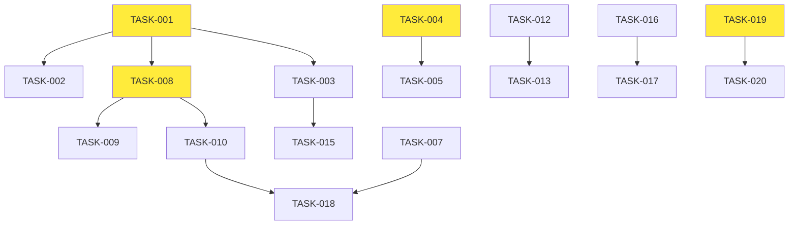

# PRD: Fort Maner E-commerce Audit & Improvement Plan
Generated: 2025-09-25
Version: 1.0

## Table of Contents
1. [Source Ticket Reference](#source-ticket-reference)
2. [Technical Interpretation](#technical-interpretation)
3. [Current State Analysis](#current-state-analysis)
4. [Functional Specifications](#functional-specifications)
5. [Technical Requirements & Constraints](#technical-requirements--constraints)
6. [User Stories with Acceptance Criteria](#user-stories-with-acceptance-criteria)
7. [Task Breakdown Structure](#task-breakdown-structure)
8. [Dependencies & Integration Points](#dependencies--integration-points)
9. [Risk Assessment & Mitigation](#risk-assessment--mitigation)
10. [Testing & Validation Requirements](#testing--validation-requirements)
11. [Monitoring & Observability](#monitoring--observability)
12. [Success Metrics & Definition of Done](#success-metrics--definition-of-done)
13. [Technical Debt & Future Considerations](#technical-debt--future-considerations)
14. [Appendices](#appendices)

## Source Ticket Reference

**Requirement**: Create a comprehensive audit and improvement plan for a Vite+React Router e-commerce application with enhanced PDP, route optimization, cart improvements, data layer strategy, SEO enhancements, and implementation roadmap.

**Current Stack**:
- Framework: Vite + React 18 + TypeScript + React Router v6
- UI: shadcn/ui + Tailwind CSS
- State: TanStack Query + Context API for cart
- Storage: localStorage for cart persistence
- Analytics: Meta Pixel integration
- Payment: Stripe integration (partial)

## Technical Interpretation

This project requires a systematic audit and enhancement of an existing Vite-based e-commerce application. The focus is on production-ready e-commerce features while maintaining the current landing page design and architecture patterns.

### Key Technical Challenges:
1. **SPA SEO Limitations**: Vite/React SPA lacks SSR capabilities for optimal SEO
2. **Route Architecture**: Missing e-commerce specific routes and proper navigation patterns
3. **Product Detail Enhancement**: Current PDP lacks variant selection, size guides, and social features
4. **Data Layer Strategy**: Need flexible architecture for local JSON → Shopify migration
5. **State Management**: Cart context needs optimization for performance and persistence
6. **Testing Strategy**: No current test framework implementation

## Current State Analysis

### Existing Route Structure
```typescript
// Current Routes (from App.tsx analysis)
Routes: {
  '/': Index (homepage),
  '/shop/fw': ShopFW,
  '/shop/ss': ShopSS,
  '/shop/capsules': Capsules,
  '/shop/capsules/:capsule': CapsuleDetail,
  '/kids': Kids,
  '/men': Men,
  '/ladies': Ladies,
  '/hats': Hats,
  '/lookbook': Lookbook,
  '/community': Community,
  '/accessories': Accessories,
  '/about': About,
  '/about-us': AboutUs,
  '/blog': Blog,
  '/product/:slug': ProductDetail,
  '/cart': Cart,
  '/checkout': Checkout,
  '/checkout/success': CheckoutSuccess,
  '/account': Account,
  '*': NotFound
}

// Missing Routes Identified:
- /contact (component exists, not routed)
- /shop (general shop landing)
- /search (product search)
- /wishlist (save for later)
- /size-guide (sizing information)
- /privacy-policy (legal)
- /terms-of-service (legal)
- /shipping-returns (policy)
- /track-order (order tracking)
- /newsletter (subscription management)
```

### Current Data Structure Analysis
```typescript
// Products Schema (from products-complete.json)
Product: {
  id: string,
  handle: string,
  slug: string,
  title: string,
  brand: string,
  price: number,
  compareAtPrice?: number,
  images: string[],
  badges: string[],
  inStock: boolean,
  description?: string,
  options?: { color?: string[], size?: string[] },
  variants: ProductVariant[],
  collections: string[],
  tags: string[],
  season: 'FW' | 'SS',
  capsule?: string,
  ageRange: 'kids' | 'adult',
  seo?: { title: string, desc: string }
}

// Current Cart Implementation Strengths:
✅ localStorage persistence
✅ Meta Pixel integration
✅ Proper TypeScript types
✅ Quantity management
✅ Total calculation

// Current Cart Implementation Gaps:
❌ No wishlist/save for later
❌ No cart abandonment recovery
❌ No cart expiry management
❌ No guest vs. authenticated state
❌ No shipping calculations
```

## Functional Specifications

### 1. Enhanced Product Detail Page (PDP)

**Current State**: Basic PDP with quantity selector and accordion details
**Target State**: Full-featured e-commerce PDP with variant selection, size guide, social sharing, and enhanced UX

**Key Features**:
- **Variant Selection**: Color/size pickers with stock validation
- **Size Guide Modal**: Interactive sizing chart
- **Social Sharing**: Native Web Share API + fallback buttons
- **Image Gallery**: Zoom functionality and mobile-optimized carousel
- **Related Products**: "You may also like" section
- **Reviews Integration**: Placeholder for future review system
- **Inventory Indicators**: Low stock warnings and out-of-stock handling

### 2. Route Architecture Enhancement

**Missing E-commerce Routes**:
```typescript
// New Routes to Implement
'/shop' -> ShopAll (consolidated product listing)
'/search' -> Search (product search with filters)
'/search?q=:query' -> Search results
'/wishlist' -> Wishlist (saved products)
'/contact' -> Contact (already exists, needs routing)
'/size-guide' -> SizeGuide (sizing information)
'/track-order' -> TrackOrder (order status)
'/privacy-policy' -> PrivacyPolicy
'/terms-of-service' -> TermsOfService
'/shipping-returns' -> ShippingReturns
'/newsletter' -> Newsletter (subscription management)
```

### 3. Enhanced Cart & Checkout System

**Cart Improvements**:
- Wishlist/Save for Later functionality
- Cart abandonment recovery (email capture)
- Shipping calculator integration
- Promo code system
- Guest vs. authenticated user handling
- Cart expiry management (7 days)

**Checkout Enhancements**:
- Multi-step checkout process
- Address validation
- Shipping method selection
- Tax calculation (if applicable)
- Order confirmation with tracking

### 4. Data Layer Strategy

**Current**: Static JSON file with normalized data
**Target**: Flexible data layer supporting local JSON and future Shopify integration

```typescript
// Data Abstraction Layer
interface DataProvider {
  getProducts(filters?: ProductFilters): Promise<Product[]>
  getProduct(slug: string): Promise<Product | null>
  searchProducts(query: string): Promise<Product[]>
  getCollections(): Promise<Collection[]>
  getBlogPosts(): Promise<BlogPost[]>
}

// Implementations:
- JsonDataProvider (current)
- ShopifyDataProvider (future)
- HybridDataProvider (migration support)
```

## Technical Requirements & Constraints

### Performance Requirements
- **Core Web Vitals**: LCP < 2.5s, FID < 100ms, CLS < 0.1
- **Bundle Size**: Main bundle < 500KB gzipped
- **Image Loading**: Lazy loading with progressive enhancement
- **Route Splitting**: Code splitting for route-based chunks

### SEO Requirements
- **Meta Tags**: Dynamic title/description per route
- **Open Graph**: Product sharing with images
- **Structured Data**: JSON-LD for products
- **Sitemap**: Dynamic sitemap generation
- **Robots.txt**: Proper crawling directives

### Accessibility Requirements
- **WCAG 2.1 AA**: Minimum compliance level
- **Keyboard Navigation**: Full keyboard accessibility
- **Screen Reader**: Semantic HTML and ARIA labels
- **Color Contrast**: 4.5:1 minimum ratio
- **Focus Management**: Proper focus indicators

### Browser Support
- **Modern Browsers**: Chrome 90+, Firefox 88+, Safari 14+
- **Mobile**: iOS Safari 14+, Chrome Mobile 90+
- **Progressive Enhancement**: Graceful degradation for older browsers

## User Stories with Acceptance Criteria

### Epic 1: Enhanced Product Discovery

**US-001: As a customer, I want to browse all products in one place**
- **Acceptance Criteria**:
  - [ ] `/shop` route displays all products with filtering
  - [ ] Filter by category, price, size, color, collection
  - [ ] Sort by price, newest, popularity
  - [ ] Pagination or infinite scroll for performance
  - [ ] Mobile-responsive grid layout
  - [ ] Filter state persists in URL parameters

**US-002: As a customer, I want to search for specific products**
- **Acceptance Criteria**:
  - [ ] Search input in header navigates to `/search`
  - [ ] Real-time search suggestions (debounced)
  - [ ] Search results show products, collections, and pages
  - [ ] Search query persists in URL and page refresh
  - [ ] "No results" state with suggested alternatives
  - [ ] Search analytics tracking

### Epic 2: Enhanced Product Detail Experience

**US-003: As a customer, I want to select product variants easily**
- **Acceptance Criteria**:
  - [ ] Color selection updates main product image
  - [ ] Size selection shows availability status
  - [ ] Out-of-stock variants are disabled but visible
  - [ ] Selected variant updates URL without page reload
  - [ ] Variant selection persists on page refresh
  - [ ] Price updates based on variant selection

**US-004: As a customer, I want to understand product sizing**
- **Acceptance Criteria**:
  - [ ] "Size Guide" button opens modal with sizing chart
  - [ ] Modal displays measurements for all available sizes
  - [ ] Size guide is accessible via keyboard navigation
  - [ ] Mobile-optimized size guide layout
  - [ ] Size guide content is manageable via CMS

**US-005: As a customer, I want to share products with others**
- **Acceptance Criteria**:
  - [ ] Native Web Share API on supported browsers
  - [ ] Fallback social sharing buttons (Facebook, Twitter, WhatsApp)
  - [ ] Copy link functionality with success toast
  - [ ] Proper Open Graph meta tags for rich sharing
  - [ ] Share analytics tracking

### Epic 3: Cart & Wishlist Management

**US-006: As a customer, I want to save products for later**
- **Acceptance Criteria**:
  - [ ] Heart icon on product cards and PDP to save/unsave
  - [ ] Wishlist persists in localStorage
  - [ ] `/wishlist` route shows saved products
  - [ ] Move items from wishlist to cart
  - [ ] Remove items from wishlist
  - [ ] Wishlist counter in header

**US-007: As a customer, I want my cart to persist across sessions**
- **Acceptance Criteria**:
  - [ ] Cart contents survive browser refresh
  - [ ] Cart expires after 7 days of inactivity
  - [ ] Cart sync between tabs/windows
  - [ ] Clear cart functionality
  - [ ] Cart abandonment recovery (email capture)

## Task Breakdown Structure

### PHASE 1: Route Architecture & Navigation (16 hours)

**TASK-001: Implement Missing Routes and Components**
- **Effort**: 8 hours
- **Dependencies**: None
- **Type**: Development
- **Status**: To Do
- **Description**: Create missing route components and add to App.tsx
- **Acceptance Criteria**:
  - [ ] Create ShopAll.tsx with product filtering
  - [ ] Create Search.tsx with search functionality
  - [ ] Create Wishlist.tsx with saved products
  - [ ] Add Contact route to App.tsx
  - [ ] Create legal/policy pages (Privacy, Terms, Shipping)
  - [ ] Update Header navigation to include new routes

**TASK-002: Enhanced Navigation Component**
- **Effort**: 4 hours
- **Dependencies**: TASK-001
- **Type**: Development
- **Status**: To Do
- **Description**: Improve header navigation with search and user features
- **Acceptance Criteria**:
  - [ ] Add search input to header
  - [ ] Add wishlist counter to header
  - [ ] Implement mobile hamburger menu
  - [ ] Add breadcrumb navigation for deep pages

**TASK-003: Route-based Code Splitting**
- **Effort**: 4 hours
- **Dependencies**: TASK-001
- **Type**: Development
- **Status**: To Do
- **Description**: Implement lazy loading for route components
- **Acceptance Criteria**:
  - [ ] Convert route imports to lazy imports
  - [ ] Add loading fallback components
  - [ ] Verify bundle splitting in build output
  - [ ] Test route loading performance

### PHASE 2: Enhanced Product Detail Page (20 hours)

**TASK-004: Variant Selection System**
- **Effort**: 8 hours
- **Dependencies**: None
- **Type**: Development
- **Status**: To Do
- **Description**: Implement color and size selection with stock validation
- **Acceptance Criteria**:
  - [ ] Color picker updates product images
  - [ ] Size selector shows stock status
  - [ ] Disabled state for out-of-stock variants
  - [ ] URL updates with selected variant
  - [ ] Price updates based on variant selection

**TASK-005: Image Gallery Enhancement**
- **Effort**: 6 hours
- **Dependencies**: TASK-004
- **Type**: Development
- **Status**: To Do
- **Description**: Enhanced image gallery with zoom and mobile optimization
- **Acceptance Criteria**:
  - [ ] Click to zoom functionality on desktop
  - [ ] Pinch to zoom on mobile
  - [ ] Image carousel with thumbnail navigation
  - [ ] Lazy loading for gallery images
  - [ ] Image loading states and error handling

**TASK-006: Size Guide Modal**
- **Effort**: 4 hours
- **Dependencies**: None
- **Type**: Development
- **Status**: To Do
- **Description**: Interactive size guide modal component
- **Acceptance Criteria**:
  - [ ] Modal opens from "Size Guide" button
  - [ ] Displays sizing chart table
  - [ ] Mobile-responsive design
  - [ ] Keyboard accessible (Esc to close, focus management)
  - [ ] Content manageable via JSON data

**TASK-007: Social Sharing Integration**
- **Effort**: 2 hours
- **Dependencies**: None
- **Type**: Development
- **Status**: To Do
- **Description**: Native and fallback social sharing functionality
- **Acceptance Criteria**:
  - [ ] Web Share API implementation with fallback
  - [ ] Social media sharing buttons
  - [ ] Copy link functionality
  - [ ] Share analytics tracking
  - [ ] Proper Open Graph meta tags

### PHASE 3: Search & Filtering System (12 hours)

**TASK-008: Product Search Implementation**
- **Effort**: 6 hours
- **Dependencies**: TASK-001
- **Type**: Development
- **Status**: To Do
- **Description**: Full-text product search with filtering
- **Acceptance Criteria**:
  - [ ] Search input with debounced API calls
  - [ ] Search by title, description, tags, collections
  - [ ] Filter by category, price range, availability
  - [ ] Sort by relevance, price, newest
  - [ ] Search result highlighting
  - [ ] URL parameter persistence

**TASK-009: Advanced Filtering UI**
- **Effort**: 4 hours
- **Dependencies**: TASK-008
- **Type**: Development
- **Status**: To Do
- **Description**: Advanced filtering interface for product discovery
- **Acceptance Criteria**:
  - [ ] Collapsible filter sidebar
  - [ ] Multi-select category filters
  - [ ] Price range slider
  - [ ] Color and size filters
  - [ ] Active filter display with remove option
  - [ ] Filter count indicators

**TASK-010: Search Analytics Integration**
- **Effort**: 2 hours
- **Dependencies**: TASK-008
- **Type**: Development
- **Status**: To Do
- **Description**: Track search behavior for optimization
- **Acceptance Criteria**:
  - [ ] Track search queries and results count
  - [ ] Track filter usage patterns
  - [ ] Track search-to-purchase conversion
  - [ ] Export search analytics to external tools

### PHASE 4: Enhanced Cart & Checkout (16 hours)

**TASK-011: Wishlist Implementation**
- **Effort**: 6 hours
- **Dependencies**: None
- **Type**: Development
- **Status**: To Do
- **Description**: Save for later functionality with persistence
- **Acceptance Criteria**:
  - [ ] Heart icon toggle on product cards and PDP
  - [ ] Wishlist state management with Context API
  - [ ] localStorage persistence
  - [ ] Wishlist page with grid layout
  - [ ] Move to cart functionality
  - [ ] Wishlist counter in header

**TASK-012: Cart Enhancement & Abandonment Recovery**
- **Effort**: 6 hours
- **Dependencies**: None
- **Type**: Development
- **Status**: To Do
- **Description**: Enhanced cart with expiry and recovery features
- **Acceptance Criteria**:
  - [ ] Cart expiry after 7 days
  - [ ] Email capture for cart recovery
  - [ ] Cart sync between browser tabs
  - [ ] Guest vs. authenticated user handling
  - [ ] Promo code input field
  - [ ] Shipping calculator integration

**TASK-013: Checkout Process Enhancement**
- **Effort**: 4 hours
- **Dependencies**: TASK-012
- **Type**: Development
- **Status**: To Do
- **Description**: Multi-step checkout with validation
- **Acceptance Criteria**:
  - [ ] Step indicator (Cart → Shipping → Payment → Confirmation)
  - [ ] Address validation and autocomplete
  - [ ] Shipping method selection
  - [ ] Order summary with tax calculation
  - [ ] Form validation with error handling
  - [ ] Mobile-optimized checkout flow

### PHASE 5: Data Layer & Performance (10 hours)

**TASK-014: Data Abstraction Layer**
- **Effort**: 6 hours
- **Dependencies**: None
- **Type**: Development
- **Status**: To Do
- **Description**: Flexible data layer supporting multiple backends
- **Acceptance Criteria**:
  - [ ] DataProvider interface definition
  - [ ] JsonDataProvider implementation (current)
  - [ ] ShopifyDataProvider interface (future-ready)
  - [ ] HybridDataProvider for migration scenarios
  - [ ] TanStack Query integration
  - [ ] Error handling and retry logic

**TASK-015: Performance Optimization**
- **Effort**: 4 hours
- **Dependencies**: TASK-003, TASK-005
- **Type**: Development
- **Status**: To Do
- **Description**: Bundle optimization and loading performance
- **Acceptance Criteria**:
  - [ ] Image lazy loading implementation
  - [ ] Bundle size analysis and optimization
  - [ ] Critical CSS inlining for above-fold content
  - [ ] Service worker for static asset caching
  - [ ] Core Web Vitals monitoring setup

### PHASE 6: SEO & Analytics (8 hours)

**TASK-016: SEO Meta Management**
- **Effort**: 4 hours
- **Dependencies**: None
- **Type**: Development
- **Status**: To Do
- **Description**: Dynamic meta tags and structured data
- **Acceptance Criteria**:
  - [ ] Dynamic title and description per route
  - [ ] Open Graph meta tags for social sharing
  - [ ] JSON-LD structured data for products
  - [ ] Canonical URL management
  - [ ] Meta tag React component

**TASK-017: Sitemap & SEO Tools**
- **Effort**: 2 hours
- **Dependencies**: TASK-016
- **Type**: Development
- **Status**: To Do
- **Description**: SEO infrastructure and tooling
- **Acceptance Criteria**:
  - [ ] Dynamic sitemap.xml generation
  - [ ] Robots.txt configuration
  - [ ] Google Search Console integration
  - [ ] SEO audit tooling setup

**TASK-018: Enhanced Analytics Integration**
- **Effort**: 2 hours
- **Dependencies**: TASK-007, TASK-010
- **Type**: Development
- **Status**: To Do
- **Description**: Comprehensive e-commerce analytics
- **Acceptance Criteria**:
  - [ ] Enhanced e-commerce events (Meta Pixel, GA4)
  - [ ] Product view tracking
  - [ ] Add to cart and purchase tracking
  - [ ] Custom conversion events
  - [ ] Analytics debugging tools

### PHASE 7: Testing & Documentation (12 hours)

**TASK-019: Test Framework Setup**
- **Effort**: 4 hours
- **Dependencies**: None
- **Type**: Testing
- **Status**: To Do
- **Description**: Comprehensive testing framework implementation
- **Acceptance Criteria**:
  - [ ] Vitest configuration for unit tests
  - [ ] React Testing Library setup
  - [ ] Playwright for E2E testing
  - [ ] Test coverage reporting
  - [ ] CI/CD test integration

**TASK-020: Component & Integration Tests**
- **Effort**: 6 hours
- **Dependencies**: TASK-019
- **Type**: Testing
- **Status**: To Do
- **Description**: Core component and user flow testing
- **Acceptance Criteria**:
  - [ ] Cart functionality tests
  - [ ] Product detail page tests
  - [ ] Search and filtering tests
  - [ ] Checkout process E2E tests
  - [ ] Accessibility tests
  - [ ] Performance regression tests

**TASK-021: Technical Documentation**
- **Effort**: 2 hours
- **Dependencies**: All development tasks
- **Type**: Documentation
- **Status**: To Do
- **Description**: Technical documentation for maintainability
- **Acceptance Criteria**:
  - [ ] API documentation for data layer
  - [ ] Component usage documentation
  - [ ] Deployment and environment setup guide
  - [ ] Performance optimization guide
  - [ ] Troubleshooting documentation

## Dependencies & Integration Points

### Critical Path Analysis



**Critical Path**: TASK-001 → TASK-008 → TASK-009 → TASK-010 → TASK-018 (28 hours)

**Parallel Work Streams**:
- **Stream A**: Route Architecture (TASK-001 → TASK-002 → TASK-003)
- **Stream B**: Product Detail (TASK-004 → TASK-005 → TASK-006 → TASK-007)
- **Stream C**: Cart/Checkout (TASK-011 → TASK-012 → TASK-013)
- **Stream D**: Data Layer (TASK-014 → TASK-015)
- **Stream E**: SEO (TASK-016 → TASK-017)

### External Dependencies

**Third-Party Services**:
- Stripe Payment Processing (already integrated)
- Meta Pixel Analytics (already integrated)
- Email service for cart abandonment (requires selection)
- CDN for image optimization (optional)

**Data Dependencies**:
- Product images and assets
- Content for legal/policy pages
- Size guide data and measurements
- Shipping rates and tax configuration

## Risk Assessment & Mitigation

### HIGH RISK

**R-001: SEO Performance in SPA Architecture**
- **Risk**: Limited SEO capabilities due to client-side rendering
- **Impact**: Reduced organic search visibility
- **Probability**: High
- **Mitigation**:
  - Implement proper meta tag management
  - Use structured data (JSON-LD)
  - Consider prerendering for critical pages
  - Optimize for Core Web Vitals

**R-002: Cart State Synchronization**
- **Risk**: Cart state inconsistencies across tabs/sessions
- **Impact**: Lost sales, poor user experience
- **Probability**: Medium
- **Mitigation**:
  - Implement proper state synchronization
  - Add cart expiry and recovery mechanisms
  - Test thoroughly across browser scenarios

### MEDIUM RISK

**R-003: Performance Degradation with Scale**
- **Risk**: Bundle size and loading performance issues as features grow
- **Impact**: Poor user experience, reduced conversions
- **Probability**: Medium
- **Mitigation**:
  - Implement code splitting early
  - Monitor bundle size in CI/CD
  - Use lazy loading for non-critical components
  - Implement proper caching strategies

**R-004: Future Shopify Migration Complexity**
- **Risk**: Difficult migration from JSON data to Shopify
- **Impact**: Development overhead, potential data loss
- **Probability**: Low
- **Mitigation**:
  - Design flexible data abstraction layer
  - Map current schema to Shopify structure
  - Plan phased migration approach
  - Maintain data consistency patterns

## Testing & Validation Requirements

### Unit Testing (Vitest + React Testing Library)
```typescript
// Example test structure
describe('Cart Functionality', () => {
  test('should add product to cart', () => {
    // Test cart addition logic
  });

  test('should persist cart across sessions', () => {
    // Test localStorage persistence
  });

  test('should calculate totals correctly', () => {
    // Test price calculations
  });
});
```

### Integration Testing
- API data fetching and error handling
- Route navigation and state persistence
- Form submission and validation
- Third-party service integration

### End-to-End Testing (Playwright)
```typescript
// Critical user flows
test('Complete purchase flow', async ({ page }) => {
  // Navigate to product → Add to cart → Checkout → Complete
});

test('Search and filter products', async ({ page }) => {
  // Search → Filter → View results → Navigate to product
});
```

### Performance Testing
- Lighthouse CI for Core Web Vitals
- Bundle size monitoring
- Load testing for high traffic scenarios
- Memory leak detection

### Accessibility Testing
- Axe-core automated testing
- Keyboard navigation testing
- Screen reader testing
- Color contrast validation

## Monitoring & Observability

### Analytics Events
```typescript
// Enhanced e-commerce tracking
interface AnalyticsEvent {
  event: 'page_view' | 'product_view' | 'add_to_cart' | 'purchase' | 'search';
  product_id?: string;
  search_query?: string;
  value?: number;
  currency?: string;
}
```

### Performance Monitoring
- Core Web Vitals tracking
- Bundle size monitoring
- API response time tracking
- Error rate monitoring

### Business Metrics
- Conversion rate by traffic source
- Average order value
- Cart abandonment rate
- Search success rate
- Product page engagement

## Success Metrics & Definition of Done

### Primary Success Metrics

**Conversion Rate Improvement**
- **Baseline**: Current conversion rate (TBD)
- **Target**: 15% increase in conversion rate
- **Measurement**: Orders / Unique visitors

**Page Load Performance**
- **Baseline**: Current LCP/FID/CLS scores
- **Target**: LCP < 2.5s, FID < 100ms, CLS < 0.1
- **Measurement**: Lighthouse CI reports

**User Engagement**
- **Baseline**: Current session duration and pages per session
- **Target**: 20% increase in session duration
- **Measurement**: Analytics dashboard

### Technical Success Criteria

**Code Quality**
- [ ] TypeScript strict mode enabled with 0 errors
- [ ] ESLint rules passing with 0 warnings
- [ ] Test coverage > 80% for critical paths
- [ ] Lighthouse score > 90 for performance
- [ ] WCAG 2.1 AA accessibility compliance

**Performance Benchmarks**
- [ ] Bundle size < 500KB gzipped
- [ ] Time to Interactive < 3.5s on 3G
- [ ] First Contentful Paint < 1.8s
- [ ] API response times < 200ms average

### Definition of Done Checklist

**Feature Completion**:
- [ ] All user stories completed with acceptance criteria met
- [ ] Code reviewed and approved by team lead
- [ ] Unit and integration tests written and passing
- [ ] E2E tests for critical user flows passing
- [ ] Accessibility audit passed
- [ ] Performance benchmarks met
- [ ] Documentation updated
- [ ] QA testing completed
- [ ] Staging environment deployed and tested
- [ ] Product owner acceptance

**Production Readiness**:
- [ ] Error monitoring configured
- [ ] Analytics tracking implemented
- [ ] SEO meta tags implemented
- [ ] Security audit completed
- [ ] Browser compatibility tested
- [ ] Mobile responsiveness verified
- [ ] Production deployment successful
- [ ] Post-deployment monitoring active

## Technical Debt & Future Considerations

### Current Technical Debt

**TD-001: Missing Test Coverage**
- **Impact**: High risk of regressions during feature development
- **Effort**: 12 hours to implement comprehensive testing
- **Priority**: High

**TD-002: Hardcoded Configuration**
- **Impact**: Difficult environment management and feature flags
- **Effort**: 4 hours to implement configuration management
- **Priority**: Medium

**TD-003: Bundle Size Optimization**
- **Impact**: Performance degradation as features grow
- **Effort**: 6 hours to implement proper code splitting
- **Priority**: Medium

### Future Migration Considerations

**Shopify Integration Planning**:
```typescript
// Future Shopify schema mapping
interface ShopifyProduct {
  id: string;
  handle: string;
  title: string;
  variants: ShopifyVariant[];
  // Map to current Product interface
}
```

**SSR/SSG Migration Path**:
- Consider Next.js migration for better SEO
- Evaluate Astro for static site generation
- Plan incremental adoption strategy

**Advanced Features Roadmap**:
- User authentication and accounts
- Product reviews and ratings
- Inventory management
- Multi-currency support
- Advanced search with AI recommendations
- Progressive Web App (PWA) features

## Appendices

### A. TypeScript Interface Definitions

```typescript
// Enhanced Product interfaces
export interface ProductVariant {
  id: string;
  sku: string;
  color?: string;
  size?: string;
  stock: number;
  price?: number; // Variant-specific pricing
  image?: string; // Variant-specific image
}

export interface ProductOption {
  name: string;
  values: string[];
}

export interface Product {
  id: string;
  handle: string;
  slug: string;
  title: string;
  brand: string;
  price: number;
  compareAtPrice?: number;
  images: string[];
  badges: string[];
  inStock: boolean;
  description?: string;
  options: ProductOption[];
  variants: ProductVariant[];
  collections: string[];
  tags: string[];
  season: Season;
  capsule?: string;
  ageRange: AgeRange;
  seo: SEOData;
  metafields?: Record<string, any>;
  relatedProducts?: string[]; // Product IDs
}

export interface SEOData {
  title: string;
  description: string;
  keywords?: string[];
  ogImage?: string;
  structuredData?: Record<string, any>;
}

// Wishlist interfaces
export interface WishlistItem {
  productId: string;
  variantId?: string;
  dateAdded: string;
  product: Product;
}

export interface WishlistState {
  items: WishlistItem[];
  itemCount: number;
}

// Search interfaces
export interface SearchFilters {
  categories?: string[];
  priceRange?: [number, number];
  colors?: string[];
  sizes?: string[];
  inStock?: boolean;
  collections?: string[];
}

export interface SearchParams {
  query?: string;
  filters?: SearchFilters;
  sort?: 'relevance' | 'price_asc' | 'price_desc' | 'newest';
  page?: number;
  limit?: number;
}
```

### B. Environment Configuration

```bash
# .env.sample updates
# Vite environment variables (client-side)
# Copy to .env and set values

# Supabase (required for Supabase features)
VITE_SUPABASE_URL="https://your-project.supabase.co"
VITE_SUPABASE_PUBLISHABLE_KEY="your-anon-key"

# Analytics & Marketing
VITE_FACEBOOK_PIXEL_ID=""
VITE_GOOGLE_ANALYTICS_ID=""
VITE_GOOGLE_TAG_MANAGER_ID=""

# E-commerce Features
VITE_STRIPE_PUBLISHABLE_KEY=""
VITE_ENABLE_WISHLIST="true"
VITE_ENABLE_SEARCH="true"
VITE_CART_EXPIRY_DAYS="7"

# Performance & SEO
VITE_ENABLE_SERVICE_WORKER="true"
VITE_IMAGE_CDN_URL=""
VITE_SITE_URL="https://fortmaner.com"

# Feature Flags
VITE_FEATURE_REVIEWS="false"
VITE_FEATURE_MULTI_CURRENCY="false"
VITE_FEATURE_ADVANCED_SEARCH="false"

# Development
VITE_DEBUG_MODE="false"
VITE_MOCK_API="false"
```

### C. Acceptance Testing Checklist (20 Items)

**Product Discovery & Navigation**:
1. [ ] All navigation links work correctly across desktop and mobile
2. [ ] Search functionality returns relevant results for product queries
3. [ ] Product filtering works correctly with multiple filter combinations
4. [ ] Product sorting options work correctly (price, newest, popularity)
5. [ ] Pagination or infinite scroll works smoothly without performance issues

**Product Detail & Variant Selection**:
6. [ ] Product images load correctly and carousel navigation works
7. [ ] Color selection updates product images and available sizes
8. [ ] Size selection shows correct availability status
9. [ ] Out-of-stock variants are properly disabled but remain visible
10. [ ] Size guide modal opens correctly and displays sizing information

**Cart & Checkout**:
11. [ ] Products can be added to cart with correct variant selection
12. [ ] Cart persists across browser sessions and tabs
13. [ ] Quantity updates in cart work correctly with proper validation
14. [ ] Checkout process completes successfully with test payment
15. [ ] Order confirmation displays correct order details

**Wishlist & Social Features**:
16. [ ] Products can be saved to wishlist and persist across sessions
17. [ ] Wishlist counter updates correctly in header navigation
18. [ ] Social sharing works correctly with proper meta tags
19. [ ] Copy link functionality works with success feedback

**Performance & Accessibility**:
20. [ ] Page load times meet performance targets (LCP < 2.5s)
21. [ ] All interactive elements are keyboard accessible
22. [ ] Color contrast meets WCAG 2.1 AA requirements

### D. 10-Minute Test Script

```bash
# E-commerce Application Test Script
# Execute these steps in sequence to validate core functionality

# 1. Homepage & Navigation (2 minutes)
✓ Load homepage and verify all navigation links work
✓ Test mobile hamburger menu functionality
✓ Verify search input appears in header
✓ Check footer links and social media icons

# 2. Product Discovery (2 minutes)
✓ Navigate to /shop and verify product grid loads
✓ Test category filtering (select 2-3 filters)
✓ Test search functionality with "hoodie" query
✓ Test sort options (price low to high)

# 3. Product Detail Page (2 minutes)
✓ Click on first product from search results
✓ Test image carousel navigation (click thumbnails)
✓ Select different color variant and verify image changes
✓ Select size and verify availability status
✓ Click "Size Guide" and verify modal opens

# 4. Cart Functionality (2 minutes)
✓ Add product to cart and verify success toast
✓ Navigate to cart page and verify product appears
✓ Update quantity and verify total calculation
✓ Test remove item functionality

# 5. Wishlist & Social Features (1 minute)
✓ Return to product page and click heart icon to save
✓ Verify wishlist counter updates in header
✓ Navigate to /wishlist and verify product appears
✓ Test social sharing button functionality

# 6. Cross-Device & Performance (1 minute)
✓ Test responsive design on mobile viewport
✓ Verify cart persists when opening new tab
✓ Check page load speed with browser dev tools
✓ Test keyboard navigation for accessibility

# Expected Results:
- All functionality works without errors
- Page load times under 3 seconds
- Mobile responsive design functions correctly
- No console errors or accessibility violations
```

---

**Total Estimated Effort**: 94 hours
**Estimated Timeline**: 12-14 weeks (assuming 8 hours/week development capacity)
**Critical Path Duration**: 28 hours
**Recommended Team Size**: 2-3 developers + 1 QA + 1 designer (for reviews)